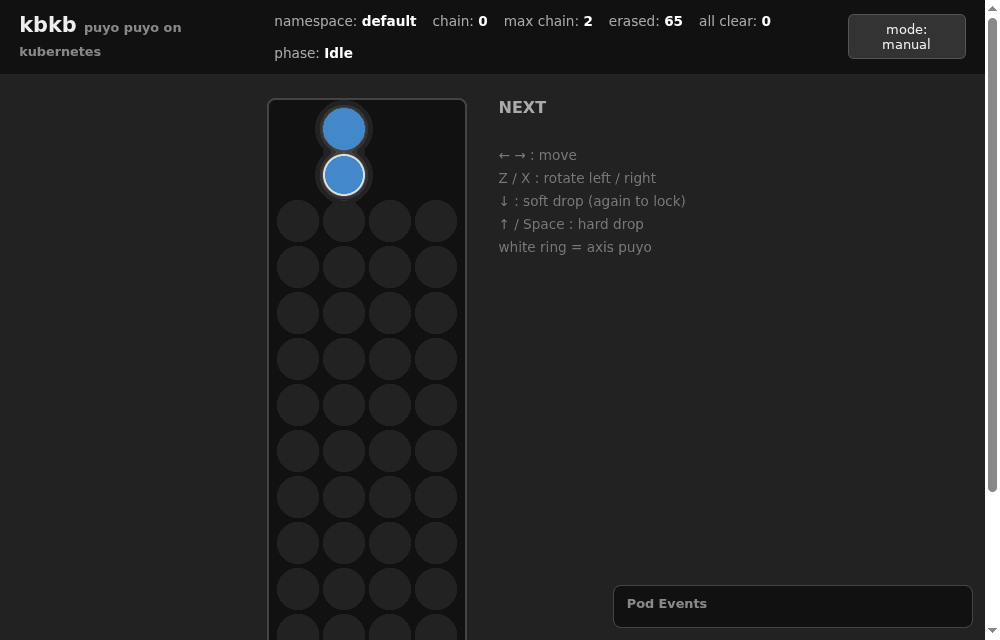

# kbkb v2

Puyo Puyo on Kubernetes — a chaos-engineering(?) toy.
Nodes are columns, Pods are puyos: when four same-colored Pods become
adjacent, they are automatically deleted.



Move, rotate and drop the pair from the web UI (the custom scheduler binds the
Pods to Nodes). When four connect, the erase controller deletes the Pods and
the Pod Events panel shows the `Running → Terminating → deleted` transitions.
The GIF above ends with a 2-chain.

This is a rewrite of the original three repos
([kbkb](https://github.com/omakeno/kbkb/tree/454afca) /
kbkb-controller / kubectl-kbkb) as a single monorepo, plus the
long-standing backlog: the full game loop (Pod spawning, random coloring,
and a scheduler that operates queued Pods two at a time).
The goal is a **19-chain**.

## Architecture

```
                 ┌─────────────────────────────────────────────────┐
                 │ kbkb-manager                                     │
  Kbkb CR ──────▶│  ├ erase controller: delete 4+ adjacency, chains │
                 │  ├ spawn controller: feed a pair once stable     │
                 │  └ webhook: random color for spawned pods        │
                 └─────────────────────────────────────────────────┘
                          │ spawn (schedulerName: kbkb-scheduler)
                          ▼
                 ┌─────────────────────────────────────────────────┐
   browser ◀───▶│ kbkb-scheduler (game server)                     │
   ←→ Z X ↓ ↑    │  ├ web UI: move/rotate/drop, SSE state stream    │
                 │  └ binds pairs to nodes via the Binding API      │
                 └─────────────────────────────────────────────────┘
```

The game loop: **spawn** (2 Pods) → **webhook** (random colors) →
**scheduler** (the player places them on columns) → Running/Ready →
**erase** on 4+ adjacency → further erases extend the **chain** → next spawn
→ … → **game over** when a column exceeds `maxHeight`.

## Layout

| Path | Contents |
|---|---|
| `pkg/field` | core logic: field assembly, adjacency groups (iterative DFS) |
| `pkg/printer` | terminal rendering with in-place ANSI redraws |
| `api/v1beta1` | the `Kbkb` CRD |
| `internal/controller` | erase controller / spawn controller |
| `internal/webhook` | pod-coloring mutating webhook |
| `internal/scheduler` | custom scheduler + web UI (`go:embed`) |
| `internal/cli` | the kubectl plugin |
| `cmd/{manager,scheduler,kubectl-kbkb}` | binaries |
| `config/` | CRD / RBAC / deployments / cert-manager (kustomize) |

## The Kbkb CRD

```yaml
apiVersion: k8s.omakenoyouna.net/v1beta1
kind: Kbkb
metadata:
  name: kbkb-sample
spec:
  kokeshi: 4                 # adjacency size required to erase
  excludeControlPlane: true  # drop control-plane nodes from the field (optional)
  nodeSelector:              # only matching nodes become columns (optional)
    kbkb: "true"
  spawn:
    enabled: true            # spawn a pair once every pod is Ready
    pair: 2                  # pods per spawn
    image: registry.k8s.io/pause:3.10
    schedulerName: kbkb-scheduler
    maxHeight: 12            # column height limit; reaching it ends the game
    disableGameOver: true    # endless mode (optional)
  versus:                    # battle mode (optional)
    opponentNamespace: player2
    garbageRate: 2           # send (erased / rate) garbage pods to the opponent
status:
  phase: Idle                # Idle / Erasing / GameOver
  chain: 0                   # chain currently in progress
  maxChain: 7                # longest chain so far — aim for 19
  totalErased: 84
  allClears: 1               # times the field was completely emptied
```

Colors come from the Pod annotation `kbkb.k8s.omakenoyouna.net/color`
(red / green / yellow / blue / purple). Uncolored and white Pods never erase
and never join a group. Garbage ("ojama") Pods are white, carry the
`kbkb.k8s.omakenoyouna.net/ojama=true` label, and the scheduler drops them
onto random columns immediately instead of queueing them.

## Playing

```bash
# 1. deploy everything (cert-manager required)
make install
make docker-build deploy   # on kind: kind load docker-image kbkb-manager:latest kbkb-scheduler:latest

# 2. start a game
kubectl apply -f config/samples/kbkb.yaml

# 3. open the web UI and play
kubectl -n kbkb-system port-forward svc/kbkb-scheduler-ui 8765:8765
# → http://localhost:8765  (←→ move, Z/X rotate, ↓ soft drop, ↑ hard drop)
```

Running outside the cluster also works:

```bash
make run-manager     # webhook disabled (no certs); color pods by hand
make run-scheduler   # serves the UI on http://localhost:8765
```

### The kubectl plugin

```bash
go build -o ~/bin/kubectl-kbkb ./cmd/kubectl-kbkb
kubectl kbkb                          # render the current namespace
kubectl kbkb -w                       # watch
kubectl kbkb -L                       # large glyphs
kubectl kbkb --demo                   # color pods by label hash (for existing clusters)
kubectl kbkb --exclude-control-plane  # hide control-plane columns
```

### Versus mode

```bash
kubectl apply -f config/samples/versus.yaml
# one scheduler per player
go run ./cmd/scheduler --namespace=player1 --listen=:8765
go run ./cmd/scheduler --namespace=player2 --listen=:8766
```

Every chain sends `erased / garbageRate` white garbage Pods raining onto the
opponent's field.

## Metrics

Exposed on the manager's `/metrics` (:8080):

- `kbkb_chain_current` / `kbkb_max_chain` — watch your chains in Grafana
- `kbkb_erased_pods_total` / `kbkb_spawned_pods_total`
- `kbkb_all_clear_total` / `kbkb_ojama_sent_total` / `kbkb_game_over`

## Changes since v1

- three repos + a shared library → a single module `github.com/omakeno/kbkb/v2`
- Go 1.13 / controller-runtime v0.6 → Go 1.26 / controller-runtime v0.24
- adjacency search: recursive DFS with O(n²) slice scans → visited matrix + iterative DFS
- bug fixes: unscheduled Pods landed in the first node's column; terminating
  Pods counted as stable
- the `bashoverwriter` dependency → a few lines of ANSI (`printer.Overwriter`)
- the kubectl plugin uses `cli-runtime` (standard `-n`/`--context` behavior)
- stacking order: creation time → the scheduler's `drop-order` annotation
  (so a rotated pair lands the way the player chose)
- backlog implemented: spawn controller / coloring webhook / pair-wise scheduler
- new: web UI play, chain & all-clear & game-over tracking, versus mode,
  Prometheus metrics

## Development

```bash
make            # generate + manifests + fmt + vet + test + build
make test
make manifests  # regenerate CRD/RBAC/webhook via controller-gen
```

The demo GIF (`docs/play.gif`) is reproducible from `hack/record/`: it drives
a headless Chrome in Docker with scripted key presses and encodes the GIF with
nothing but the Go standard library:

```bash
docker run -d --rm --name kbkb-cdp -p 9222:9222 chromedp/headless-shell
cd hack/record && go run .   # run ./stage-chain.sh in another shell for a chain scene
```
